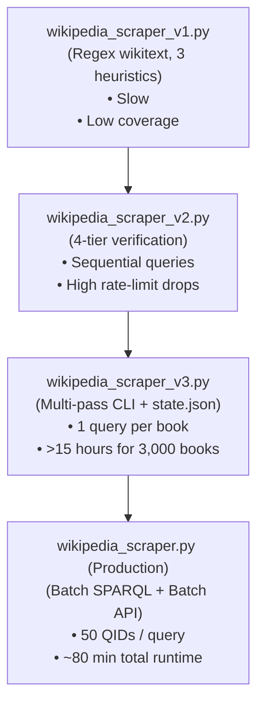

# Archive: Superseded Scripts & Historical Notebooks

> [!NOTE]
> **Reference & Audit Archive Only**  
> The files in this directory are earlier, superseded iterations developed during the project lifecycle. They are preserved for academic reproducibility, code auditability, and version history. **None of the files in this directory are required for executing or reproducing the current project pipeline.**  
> For production training, inference, and analysis, refer to the active directories: [`phase1_genre_classification/`](../phase1_genre_classification/) and [`phase2_mismatch_detection/`](../phase2_mismatch_detection/).

---

## Directory Overview

```text
archive/
├── README.md                          # This documentation file
├── phase1_superseded/
│   ├── inference_v1.py                # V1 inference: single model (RoBERTa), hardcoded 0.75 threshold
│   ├── validate_topics_v1.py          # V1 topic validator: basic stats, missed degenerate-uniform distributions
│   └── mismatch_detection_v1.ipynb    # V1 mismatch: 4 heads, severe text asymmetry bug, empty genre list bug
└── phase2_superseded/
    ├── wikipedia_scraper_v1.py        # V1 scraper: 3 heuristic strategies, regex wikitext parsing, low yield
    ├── wikipedia_scraper_v2.py        # V2 scraper: 4-tier verification (Wikidata P144), sequential queries
    └── wikipedia_scraper_v3.py        # V3 scraper: Multi-pass with state persistence, 1 query/book (~15+ hours)
```

---

## Superseded Files Summary

| Original Filename | Archive Filename | Why Superseded | Replaced By |
|---|---|---|---|
| `inference_test.py` | [`phase1_superseded/inference_v1.py`](phase1_superseded/inference_v1.py) | Hardcoded for RoBERTa only; fixed global threshold (0.75); only 3 static test inputs; lacks batch evaluation and fallback logic. | [`phase1_genre_classification/scripts/inference.py`](../phase1_genre_classification/scripts/inference.py) |
| `validate_topics.py` | [`phase1_superseded/validate_topics_v1.py`](phase1_superseded/validate_topics_v1.py) | Basic entropy and top-$k$ mass checks only; lacked critical check for degenerate-uniform topic distributions (`std(H) < 0.05`); lacks formal automated test assertions. | [`phase1_genre_classification/scripts/validate_topics.py`](../phase1_genre_classification/scripts/validate_topics.py) |
| `mismatch_detection_v1.ipynb` | [`phase1_superseded/mismatch_detection_v1.ipynb`](phase1_superseded/mismatch_detection_v1.ipynb) | Only 4 scoring heads; critical text asymmetry bug (TMDB overviews ~310 chars vs CMU summaries ~3,100 chars); bug with empty `movie_genres_list` breaking genre shift; no wrong-match filtering. | [`phase2_mismatch_detection/notebooks/mismatch_detection.ipynb`](../phase2_mismatch_detection/notebooks/mismatch_detection.ipynb) |
| `Wikipedia_scraper.py` | [`phase2_superseded/wikipedia_scraper_v1.py`](phase2_superseded/wikipedia_scraper_v1.py) | Relied on fragile regex wikitext parsing and 3 heuristic searches; slow execution; poor adaptation recall and low plot extraction yield. | [`phase2_mismatch_detection/scripts/wikipedia_scraper.py`](../phase2_mismatch_detection/scripts/wikipedia_scraper.py) |
| `Wikipedia_scraper_v2.py` | [`phase2_superseded/wikipedia_scraper_v2.py`](phase2_superseded/wikipedia_scraper_v2.py) | Introduced 4-tier verification (Wikidata P144, adaptation sections, categories, fuzzy title), but issued sequential one-off requests causing high latency and rate-limit drops. | [`phase2_mismatch_detection/scripts/wikipedia_scraper.py`](../phase2_mismatch_detection/scripts/wikipedia_scraper.py) |
| `Wikipedia_scraper_v3.py` | [`phase2_superseded/wikipedia_scraper_v3.py`](phase2_superseded/wikipedia_scraper_v3.py) | Structured multi-pass CLI with JSON state checkpointing (`scrape_state.json`), but made 1 SPARQL / Wikipedia API call per book (~15+ hours for 3,000 books). | [`phase2_mismatch_detection/scripts/wikipedia_scraper.py`](../phase2_mismatch_detection/scripts/wikipedia_scraper.py) |

---

## Phase 1: Genre Classification & Topic Modeling

### 1. `inference_v1.py`
- **Archive Path:** `archive/phase1_superseded/inference_v1.py`
- **Replaced By:** `phase1_genre_classification/scripts/inference.py`
- **Deficiencies in V1:**
  - **Single Architecture Hardcoded:** Only implemented inference for `roberta-base` using `roberta_base_best.pt`. Could not run DistilBERT, DeBERTa, or the topic fusion architectures.
  - **Static Global Threshold:** Used a hardcoded threshold of `0.75` across all 12 classes instead of empirically tuned per-genre decision boundaries (which range from 0.20 to 0.75 depending on class prevalence and calibration).
  - **No Fallback / Batch Support:** Lacked Top-$K$ fallback handling for unconfident classifications, which led to high rates of empty predictions on ambiguous texts.
- **Improvements in Production:**
  - Unified multi-model support: dynamically instantiates `RoBERTaClassifier`, `DistilBERTClassifier`, `RoBERTaFusionClassifier`, or `Longformer`.
  - Reads calibrated threshold arrays from metadata or validation sweeps.
  - Adds batch processing, fallback guarantees (at least Top-$K$ predicted genres), and interactive CLI input options.

### 2. `validate_topics_v1.py`
- **Archive Path:** `archive/phase1_superseded/validate_topics_v1.py`
- **Replaced By:** `phase1_genre_classification/scripts/validate_topics.py`
- **Deficiencies in V1:**
  - **Missing Degenerate-Uniform Collapse Detection:** V1 computed mean entropy and normalized entropy, but did not measure the standard deviation of entropy across documents (`std(H)`). When topic models collapsed into near-uniform topic distributions across documents, V1 failed to raise an alert.
  - **Limited Heuristics:** Evaluated only basic top-$k$ mass and coarse entropy bounds without statistical hypothesis thresholds or distribution drift metrics.
  - **Informal Reporting:** Printed raw statistics to standard output without discrete pass/fail status codes, making automated test integration impossible.
- **Improvements in Production:**
  - Formal 12-test assertion suite (`T1` through `T12`) reporting `PASS`, `WARN`, or `FAIL`.
  - Introduces `STD_ENTROPY_MIN = 0.05` to specifically intercept degenerate-uniform distributions.
  - Verifies Jensen-Shannon / Kullback-Leibler distribution shifts across train/val/test splits (`KL_SHIFT_MAX = 0.10`).
  - Measures mutual information against target genres (`MI_MIN = 0.005`) and centroid coherence (`COH_MIN = 0.50`).

### 3. `mismatch_detection_v1.ipynb`
- **Archive Path:** `archive/phase1_superseded/mismatch_detection_v1.ipynb`
- **Replaced By:** `phase2_mismatch_detection/notebooks/mismatch_detection.ipynb`
- **Deficiencies in V1:**
  - **Severe Text Asymmetry Bug:** Evaluated short TMDB movie overviews (~310 characters average) directly against detailed CMU book summaries (~3,100 characters average). The 10x length disparity produced artificial dissimilarity in semantic embeddings and TF-IDF representations.
  - **Empty `movie_genres_list` Bug:** A column merge error caused `movie_genres_list` to be empty or unparsed, silently breaking the genre transition matrix and yielding degenerate Jensen-Shannon Divergence scores.
  - **4 Heads Instead of 5:** Omitted the balanced dual-representation schema and lacked proper entity/TF-IDF weighting adjustments (entity overlap and TF-IDF had a 0.81 correlation, causing distortion without weight dampening).
  - **No Erroneous Pair Filtering:** Lacked a sanity threshold to discard noisy scraper matches where the scraped movie was unrelated to the source book.
- **Improvements in Production:**
  - Replaces TMDB short blurbs with full scraped Wikipedia movie plot summaries (800–2,000 words), balancing text lengths against book summaries.
  - Full 5-head scoring model with calibrated weights:
    - Semantic Distance (0.35)
    - Genre Shift via predicted JSD (0.25)
    - TF-IDF Distance (0.25)
    - Entity Overlap via spaCy NER (0.10)
    - Sentiment Delta via VADER (0.05)
  - Filters out incorrect scraper pairs (`cosine_similarity < 0.20`).
  - Includes validated adaptation benchmarks (faithfulness validation on canonical pairs like *The Godfather*, *Fight Club*, *The Shining*).

---

## Phase 2: Book-to-Movie Wikipedia Scraping Pipeline

The scraping infrastructure underwent extensive architectural revisions due to Wikipedia and Wikidata rate limits, disambiguation ambiguities, and long-tail query latencies.

### Evolution of Scraper Scripts



### Detailed Comparison

| Feature / Metric | V1 (`wikipedia_scraper_v1.py`) | V2 (`wikipedia_scraper_v2.py`) | V3 (`wikipedia_scraper_v3.py`) | V4 (`phase2_mismatch_detection/scripts/wikipedia_scraper.py`) |
|---|---|---|---|---|
| **Query Strategy** | Title search heuristics | 4-tier cascade (Wikidata, Book page, Author cat, Fuzzy) | 4-tier cascade separated into discrete execution passes | Batch SPARQL + Batch MediaWiki API queries |
| **Batching** | None (1 page/call) | None (1 page/call) | None (1 page/call) | **50 QIDs/query (SPARQL VALUES)**, **50 pages/call (API)**, **20 film plots/call** |
| **State Persistence** | Basic JSON cache | JSON cache | Structured `scrape_state.json` | Incremental state checkpointing with Phase A search caching |
| **Error Handling** | None | Basic `try/except` | Basic logging | `AlertTracker`, exponential backoff with `Retry-After`, SPARQL POST fallback |
| **Runtime (3,000 books)** | Incomplete / Fails | 6–10+ hours (timeouts) | > 15 hours | **~80 minutes** |
| **Adaptation Pairs Yield** | Low (~150 pairs) | Moderate (~350 pairs) | Moderate (~480 pairs) | **High (619 verified adaptation pairs)** |

---

## Migration Guide for Developers

If you are inspecting or reusing code from this repository:

1. **Do not run scripts inside `archive/` directly.** Their relative paths point to earlier data folder layouts, and several contain unhandled edge cases or API bottlenecks.
2. **For Genre Classification & Topic Modeling:** Use the scripts and notebooks under [`phase1_genre_classification/`](../phase1_genre_classification/).
3. **For Adaptation Scraping & Mismatch Scoring:** Use the pipeline scripts and notebooks under [`phase2_mismatch_detection/`](../phase2_mismatch_detection/).
4. **For Reproducing Results:** Refer to the comprehensive walk-through documented in [`docs/walkthrough.md`](../docs/walkthrough.md).
