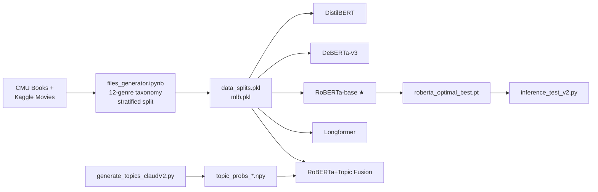
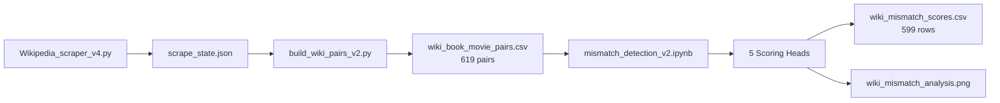

# NLP Pipeline — Comprehensive Audit Walkthrough

## Project Overview

End-to-end NLP pipeline for **multi-label genre classification** (12 genres) and **book-to-movie mismatch detection** using transformer models. Dataset: [Kaggle Movies Dataset](https://www.kaggle.com/datasets/rounakbanik/the-movies-dataset) + CMU Book Summaries + Wikipedia scraping.

---

## 1. File Inventory & Status

### Documentation
| File | Status | Notes |
|------|--------|-------|
| [proposal.txt](file:///d:/NLP_Project/NLP_Project/proposal.txt) | ✅ Corrected | Dataset updated from IMDB → Kaggle |
| [project_requirement.txt](file:///d:/NLP_Project/NLP_Project/project_requirement.txt) | ✅ Verified | Report structure/deliverables |

### Data Pipeline Scripts (Local)
| File | Status | Purpose |
|------|--------|---------|
| [Wikipedia_scraper_v4.py](file:///d:/NLP_Project/NLP_Project/Wikipedia_scraper_v4.py) | ✅ Production | Batch SPARQL scraper, ~80 min for 3K books |
| [Wikipedia_scraper_v3.py](file:///d:/NLP_Project/NLP_Project/Wikipedia_scraper_v3.py) | ⚠️ Superseded | V3 predecessor, multi-pass logic |
| [build_wiki_pairs_v2.py](file:///d:/NLP_Project/NLP_Project/build_wiki_pairs_v2.py) | ✅ Verified | Builds final CSV from scrape state |
| [generate_topics_V2.py](file:///d:/NLP_Project/NLP_Project/generate_topics_V2.py) | ✅ Verified | MiniBatchKMeans + RBF kernel topic model |
| [validate_topics_V2.py](file:///d:/NLP_Project/NLP_Project/validate_topics_V2.py) | ✅ Verified | Topic quality checks (entropy, coherence) |
| [validate_topics.py](file:///d:/NLP_Project/NLP_Project/validate_topics.py) | ⚠️ Superseded | V1 validator |

### Inference Scripts (Local)
| File | Status | Purpose |
|------|--------|---------|
| [inference_test_v2.py](file:///d:/NLP_Project/NLP_Project/inference_test_v2.py) | ✅ Production | RoBERTa inference with per-genre thresholds |
| [inference_test.py](file:///d:/NLP_Project/NLP_Project/inference_test.py) | ⚠️ Superseded | V1 inference |

### Training Scripts (Kaggle-targeted)
| File | Status | Purpose |
|------|--------|---------|
| [longformerV2.py](file:///d:/NLP_Project/NLP_Project/longformerV2.py) | ✅ Verified | Longformer training for long-context classification |

### Kaggle/Colab Notebooks
| Notebook | Markdown Log | Status |
|----------|-------------|--------|
| [files_generator.ipynb](file:///d:/NLP_Project/NLP_Project/files_generator.ipynb) | [markdown](file:///d:/NLP_Project/NLP_Project/vertopal.com_files_generator.markdown) | ✅ Verified — CMU/TMDB parsing, 12-genre taxonomy, stratified splitting |
| [disitilbert.ipynb](file:///d:/NLP_Project/NLP_Project/disitilbert.ipynb) | [markdown](file:///d:/NLP_Project/NLP_Project/vertopal.com_disitilbert.markdown) | ✅ Verified — DistilBERT training with FP16, per-genre thresholds |
| [deberta.ipynb](file:///d:/NLP_Project/NLP_Project/deberta.ipynb) | [markdown](file:///d:/NLP_Project/NLP_Project/vertopal.com_deberta.markdown) | ✅ Verified — DeBERTa-v3 with FP32 fix, gradient checkpointing |
| [robertaV2.ipynb](file:///d:/NLP_Project/NLP_Project/robertaV2.ipynb) | [markdown](file:///d:/NLP_Project/NLP_Project/vertopal.com_robertaV2.markdown) | ✅ Verified — RoBERTa-base optimal pipeline |
| [robert_topic_modelling.ipynb](file:///d:/NLP_Project/NLP_Project/robert_topic_modelling.ipynb) | [markdown](file:///d:/NLP_Project/NLP_Project/vertopal.com_robert_topic_modelling.markdown) | ✅ Verified — RoBERTa + Topic Fusion (two-stream arch) |
| [mismatch_detection_v2.ipynb](file:///d:/NLP_Project/NLP_Project/mismatch_detection_v2.ipynb) | [markdown](file:///d:/NLP_Project/NLP_Project/vertopal.com_mismatch_detection_v2/5c1e6bb8c94843c383a8d757f488178e.markdown) | ✅ Verified — 5-head mismatch scoring pipeline |
| [mismatch_detection_v1.ipynb](file:///d:/NLP_Project/NLP_Project/mismatch_detection_v1.ipynb) | — | ⚠️ Superseded by V2 |

### Model Weights (Local)
| File | Size | Source |
|------|------|--------|
| `roberta_base_best.pt` | 499 MB | Earlier RoBERTa run |
| `roberta_optimal_best.pt` | 499 MB | Best RoBERTa (Macro-F1 0.6951 val) |

### Data Files
| Directory | Key Files |
|-----------|-----------|
| `data/` | `cmu_cleaned.csv`, `data_splits.pkl`, `mlb.pkl`, `scrape_state.json`, `topic_probs_*.npy`, `wiki_book_movie_pairs.csv` |
| `dataset/` | `booksummaries.txt` (CMU raw), `movies_metadata.csv` (Kaggle raw), `movies_cleaned.csv`, `book_movie_pairs.csv`, `cmu_cleaned.csv` |

---

## 2. Model Performance Summary

| Model | Val Macro-F1 | Test Macro-F1 | Test Micro-F1 | Hamming Loss | Training Time | GPU |
|-------|-------------|---------------|---------------|-------------|---------------|-----|
| **DistilBERT** | ~0.68 | ~0.68 | — | — | ~2.5 hrs | T4 |
| **DeBERTa-v3** | 0.6510 | 0.6496 | 0.6689 | 0.1077 | 6:33 hrs | T4 (FP32) |
| **RoBERTa-base** | **0.6951** | **0.6870** | **0.6951** | **0.0975** | 3:18 hrs | T4 (FP16) |
| **RoBERTa+Topic Fusion** | 0.6883 | 0.6828 | 0.6897 | 0.1003 | 2:47 hrs | T4 (FP16) |

> [!IMPORTANT]
> **RoBERTa-base is the best-performing model** (Test Macro-F1: 0.6870). The Topic Fusion variant did NOT beat the baseline — it slightly underperformed (delta: −0.0042 test). The fusion model improved only Fantasy (+0.035) and Non-Fiction (+0.005); all other genres regressed or were neutral.

### Per-Genre F1 (RoBERTa-base — Best Model)
| Genre | Precision | Recall | F1 | Support |
|-------|-----------|--------|-----|---------|
| Action | 0.58 | 0.72 | 0.64 | 1247 |
| Comedy | 0.64 | 0.74 | 0.69 | 1958 |
| Drama | 0.67 | 0.86 | **0.75** | 3135 |
| Horror | 0.67 | 0.76 | 0.71 | 785 |
| Thriller | 0.67 | 0.77 | 0.71 | 1913 |
| Sci-Fi | 0.77 | 0.74 | **0.75** | 902 |
| Fantasy | 0.54 | 0.70 | 0.61 | 710 |
| Romance | 0.50 | 0.66 | 0.57 | 1066 |
| Animation | 0.58 | 0.67 | 0.62 | 286 |
| Documentary | 0.84 | 0.85 | **0.84** | 581 |
| Literary Fiction | 0.51 | 0.85 | 0.64 | 718 |
| Non-Fiction | 0.64 | 0.77 | 0.70 | 64 |

---

## 3. Architecture & Design Decisions Verified

### Genre Classification Pipeline

### Mismatch Detection Pipeline

### Key Technical Constraints Verified

| Constraint | Details | Notebook Confirmation |
|-----------|---------|----------------------|
| DeBERTa FP32 | `torch.autocast` disabled; explicit `.float()` casts | ✅ `vertopal.com_deberta.markdown` L560+ |
| DeBERTa `.tolist()` | Tokenizer returns non-standard types; `.tolist()` required before `.to(device)` | ✅ `UltraFastDebertaDataset.__init__` |
| VRAM caching | All datasets pre-tokenized and loaded into GPU VRAM | ✅ All training notebooks |
| Per-genre thresholds | Sweep 0.20→0.85 per genre (not global 0.5) | ✅ All training notebooks |
| Gradient checkpointing | RoBERTa: ON (enables batch_size=64) | ✅ `vertopal.com_robertaV2.markdown` L1191 |
| Cosine LR scheduler | With 10% warmup | ✅ All training notebooks |
| FP16 GradScaler guard | `scale_before` check before `scheduler.step()` | ✅ All RoBERTa notebooks |

---

## 4. Mismatch Detection — Verified Design

### 5-Head Composite Scoring
| Head | Weight | Metric | Mean Score |
|------|--------|--------|-----------|
| **A: Semantic Distance** | 0.35 | Cosine distance (MiniLM-L6-v2) | 0.3811 |
| **B: Genre Shift** | 0.25 | JSD of RoBERTa-predicted genre probs | 0.1038 |
| **C: Sentiment Delta** | 0.05 | VADER on first 1500 chars | 0.6342 |
| **D: Entity Overlap** | 0.10 | Jaccard distance of spaCy NER | 0.7951 |
| **E: TF-IDF Distance** | 0.25 | Cosine distance of TF-IDF vectors | 0.6519 |

### Key V2 Fixes Verified
- ✅ **Wrong-match filter**: Pairs with cosine_sim < 0.20 removed (20 scraper errors)
- ✅ **Genre transition matrix**: Uses `book_genres_predicted`/`movie_genres_predicted` (not empty `movie_genres_list`)
- ✅ **Rebalanced weights**: Entity weight reduced (0.10) due to 0.81 correlation with TF-IDF
- ✅ **Sanity checks**: Known faithful/divergent pairs tested (7/7 faithful ✅, 2/3 divergent ✅)

### Known Limitation
The Shining scores as "Faithful" (0.327) because entity overlap and TF-IDF both pull it down — Kubrick's film shares characters, locations, and plot elements but inverts thematic meaning. This is documented in the notebook as a known limitation of surface-level metrics.

---

## 5. Proposal ↔ Implementation Parity

| Proposal Claim | Implementation Status |
|---------------|----------------------|
| Dataset: Kaggle Movies Dataset | ✅ Corrected in proposal.txt |
| Multi-model approach (DistilBERT, DeBERTa-v3, Longformer) | ✅ All trained + RoBERTa added |
| Genre classification | ✅ 12-label multi-label classification |
| Book-movie mismatch detection | ✅ 5-head scoring, 599 pairs, visualization |
| Topic modeling integration | ✅ Attempted (fusion model), did not improve baseline |
| Wikipedia scraping for plot data | ✅ V4 scraper, batch SPARQL |
| Per-genre threshold tuning | ✅ Across all models |

---

## 6. Issues & Recommendations

> [!WARNING]
> ### Discrepancies Found
> 1. **DeBERTa underperformed RoBERTa significantly** (0.6496 vs 0.6870 test Macro-F1) despite being a "bigger" model — the FP32 constraint limits batch size and training efficiency.
> 2. **Topic Fusion did not beat the baseline** — the 30-dim topic probabilities from MiniBatchKMeans/RBF kernel didn't add enough signal beyond what RoBERTa already captures from text.
> 3. **Heart of Darkness → Apocalypse Now** was caught by the wrong-match filter (cosine_sim=0.181), so it cannot be evaluated as a divergent pair. This is actually a genuine adaptation with extreme divergence — the threshold of 0.20 may be slightly too aggressive for very loose adaptations.

> [!TIP]
> ### Recommendations
> 1. The **RoBERTa-base optimal model** is your best model — use `roberta_optimal_best.pt` for all downstream inference.
> 2. For the final report, focus on the RoBERTa results as the primary model, with DistilBERT and DeBERTa as comparison points.
> 3. The topic fusion experiment is valuable as a **negative result** — document it as showing that RoBERTa's [CLS] representation already captures topic information.
> 4. Consider lowering `WRONG_MATCH_THRESHOLD` to 0.15 to retain pairs like Heart of Darkness → Apocalypse Now.
